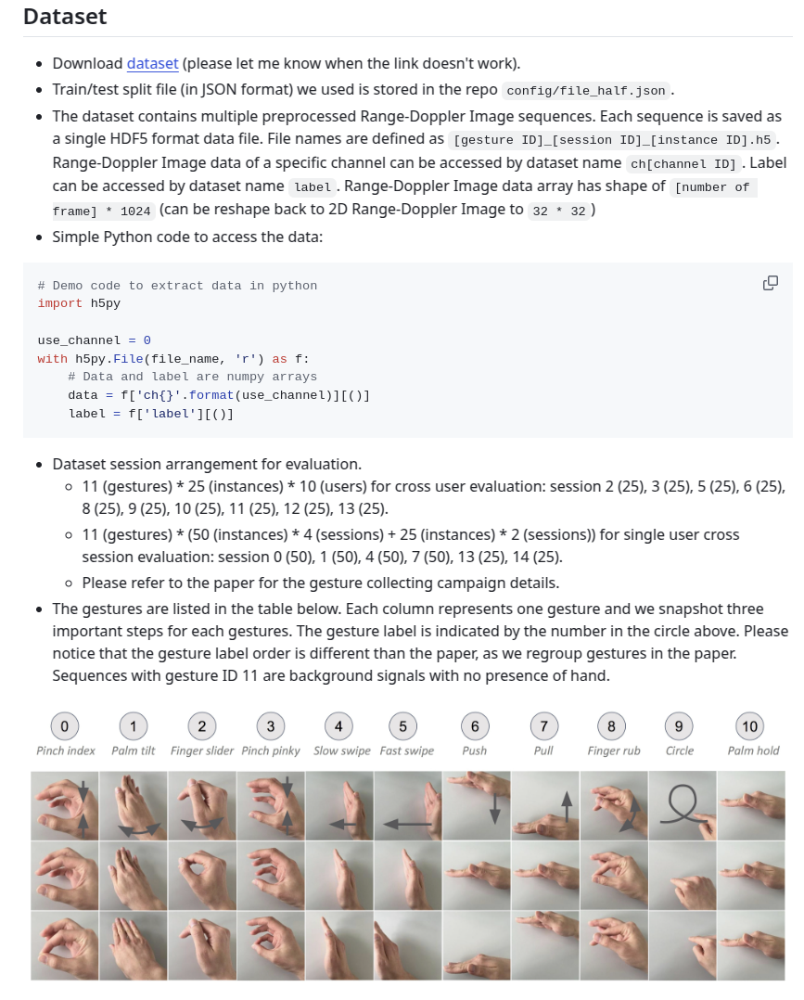
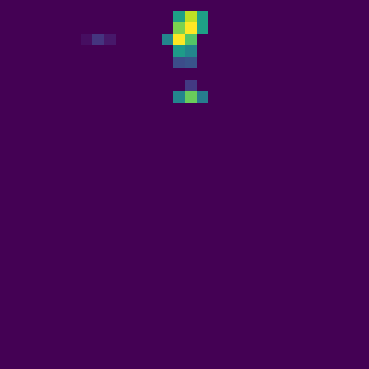
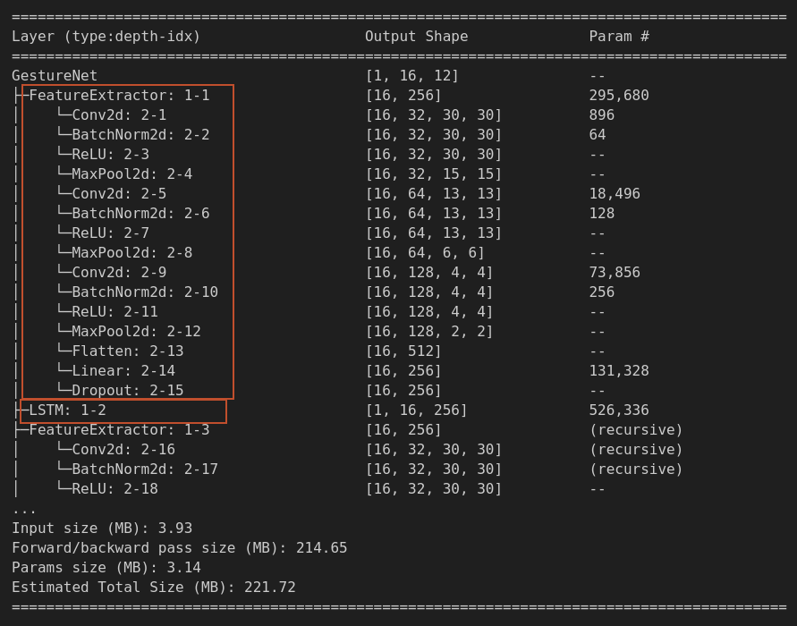
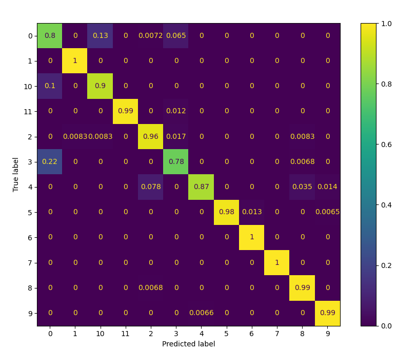
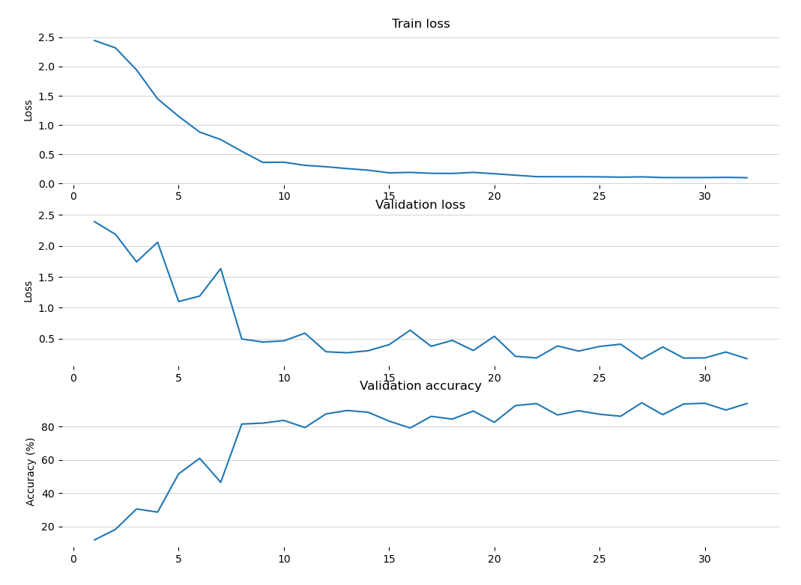

# 转载说明
原项目地址`https://github.com/4uf04eG/FMCW-gesture-recognition`

## Hand gesture recognition with FMCW

Model pre-trained on [Deep soli dataset](https://github.com/simonwsw/deep-soli/tree/master) and fine-tuned on self-collected dataset recorded using BGT60TR13C 60 GHz FMCW radar. It consists of only 350 classes over 7 classes recorded by only one person (the dataself is not included). Therefore the model is not production-ready. The model itself is a combination of CNN for spacial features extraction and LSTM for temporal features extraction.

**本项目基于原项目做了部分修改和说明文档。**


---


#  基于FMCW雷达的手势识别模型

## 数据集[deep-soli](https://github.com/simonwsw/deep-soli/tree/master)



数据经过预处理后，格式为[frameNum, channalNum, 32, 32]，其中FrameNum是一次动作采集的帧数，channalNum是接收天线通道数，此处一共有4个接收天线，不过训练数据之只有了前三个通道，32×32就是RangeDopplerMap的大小。


## 数据范例

**Slow swipe**



**Push**


## 模型结构


模型分为两个部分：CNN+LSTM，结构如下：



CNN部分用于提取空间特征，LSTM部分则用于提取时间特征，两者结合用于识别手势动作。


## 模型训练与验证

### 数据集准备

在`model.py`文件中，修改数据集地址

```python
# 定义第二个手势数据集类  
class GestureDataset2(Dataset):  
    # 基于 https://github.com/simonwsw/deep-soli  

    def __init__(self):  
        self.imgs_path = "/home/charles/Code/dataSet/SoliData/dsp/"  # 数据集路径  

    ...
```


### 模型训练
```cmd
cd PATH/FMCW-gesture-recognition/

python myTrain.py
```

### 模型验证

```cmd
python myTest.py
```



### LOSS数据查看
```cmd
python tools/readLossData.py
```
